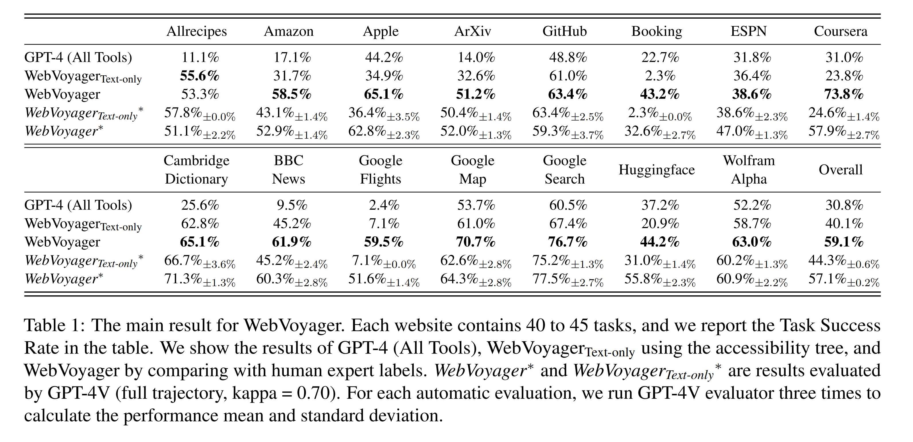

# WebVoyager 改動說明 
by 113524013 張祐豪

## 📄 **1. 主要改動概述**

- 使用 `.env` 檔案來設定 `OPENAI_API_KEY`、`OPENAI_API_MODEL` 和 `TEST_FILE`，簡化啟動流程。
- 互動模式改為動態新增任務，並支援任務確認與刪除，避免不小心執行錯誤任務。
- 在程式啟動時，自動清空 `.jsonl`，確保每次執行都是新的任務流程。

---

## ⚙️ **2. 如何設定環境變數 (`.env` 檔案)**

請在專案根目錄下建立 `.env` 檔案，並加入以下內容：

```env
OPENAI_API_KEY=sk-xxxxxxxxxxxxxxxxxxxxxxxxxxxxxxxx
OPENAI_API_MODEL=gpt-4-vision-preview
TEST_FILE=data/tasks_test.jsonl
```

- **`OPENAI_API_KEY`**：您的 OpenAI API 金鑰。
- **`OPENAI_API_MODEL`**：預設使用 `gpt-4-vision-preview`，可依需求修改。
- **`TEST_FILE`**：任務資料檔案位置。

---

## 🚀 **3. 主要程式碼改動**

### **(1) 自動載入 `.env`**
```python
from dotenv import load_dotenv
import os
import argparse

# 自動載入 .env 檔案
load_dotenv()

def main():
    parser = argparse.ArgumentParser()
    parser.add_argument('--test_file', type=str, default=os.getenv("TEST_FILE"))
    parser.add_argument('--api_key', type=str, default=os.getenv("OPENAI_API_KEY"))
    parser.add_argument('--api_model', type=str, default=os.getenv("OPENAI_API_MODEL", "gpt-4-vision-preview"))
    parser.add_argument('--max_iter', type=int, default=5)
    args = parser.parse_args()
```

---

### **(2) 啟動時清空 `.jsonl` 檔案**
```python
TASK_FILE = os.getenv("TEST_FILE", "data/tasks_test.jsonl")

def clear_task_file():
    '''清空 .jsonl 檔案'''
    with open(TASK_FILE, 'w', encoding='utf-8') as f:
        pass
    print(f"🗑️ 任務檔案已清空：{TASK_FILE}")
```

---

### **(3) 新增任務，支援確認或刪除**
```python
def add_task():
    """動態新增學習任務"""
    while True:
        print("📝 你可以選擇以下學習任務類型：")
        print("1️⃣ 查單字")
        print("2️⃣ 找相關影片")
        print("3️⃣ 問文法問題")

        choice = input("請輸入選項 (1/2/3)：")

        if choice == '1':
            word = input("請輸入你想查的英文單字：")
            task = {
                "web_name": "英語學習助手",
                "id": "word_lookup",
                "ques": f"請幫我查 '{word}' 的意思，並給我一個例句。",
                "web": f"https://tw.dictionary.search.yahoo.com/search?p={word}"
            }
        elif choice == '2':
            topic = input("請輸入你想閱讀的主題 (e.g., 環保、科技、旅遊)：")
            task = {
                "web_name": "英語相關影片",
                "id": "video_suggestion",
                "ques": f"請推薦一篇與 '{topic}' 相關的英文刊物。",
                "web": f"https://tw.voicetube.com/channels/news-and-current-affairs"
            }
        elif choice == '3':
            grammar = input("請輸入你想學的文法概念 (e.g., 現在完成式、被動語態)：")
            task = {
                "web_name": "文法小老師",
                "id": "grammar_help",
                "ques": f"請找搜尋出 '{grammar}'，點選到文法頁面。",
                "web": "https://www.ehanlin.com.tw/app/keyword/%E5%9C%8B%E4%B8%AD/%E8%8B%B1%E8%AA%9E/%E5%88%97%E8%A1%A8.html"
            }
        else:
            print("❌ 無效選項，請重新輸入。")
            continue

        # 顯示預覽
        print("\n🔍 預覽任務內容：")
        print(json.dumps(task, ensure_ascii=False, indent=2))

        confirm = input("✅ 確認任務？ (y=確認, r=重新輸入, c=取消新增)：").lower()

        if confirm == 'y':
            with open(TASK_FILE, 'a', encoding='utf-8') as f:
                json.dump(task, f, ensure_ascii=False)
                f.write('\n')
            print(f"✅ 新任務已儲存！")
            break
        elif confirm == 'r':
            print("🔄 重新輸入任務...")
        elif confirm == 'c':
            print("❌ 取消新增任務。")
            break
        else:
            print("❓ 無效選項，請輸入 'y', 'r' 或 'c'。")
```

---

### **(4) 動態讀取與處理任務**
```python
def load_tasks(file_path):
    '''動態讀取 JSONL 檔案'''
    tasks = []
    try:
        with open(file_path, 'r', encoding='utf-8') as f:
            for line in f:
                tasks.append(json.loads(line))
    except FileNotFoundError:
        print(f"❌ 檔案 {file_path} 不存在，請檢查路徑。")
    return tasks

def process_tasks(tasks):
    '''處理任務的邏輯'''
    for task in tasks:
        print(f"🚀 正在處理任務：{task.get('ques', '未提供問題')}")
        time.sleep(1)
```

---

### **(5) 指令控制迴圈**
```python
while True:
    command = input("👉 指令 ('a'=新增任務, 'q'=執行任務, 'x'=結束程式)：").lower()

    if command == 'a':
        add_task()

    elif command == 'q':
        tasks = load_tasks(args.test_file)
        if tasks:
            process_tasks(tasks)
        else:
            print("⚠️ 沒有任務可執行，請先新增任務。")

    elif command == 'x':
        print("👋 程式已結束！")
        break

    else:
        print("❓ 無效指令，請輸入 'a'、'q' 或 'x'。")
```

---

## ✅ **4. 執行方式**

```bash
python run.py
```

- `a` → 新增任務。
- `r` → 載入任務。
- `q` → 執行程式或離開任務。

---

## ✅ **5. 注意事項**
- 確保 `.env` 設定正確，否則程式將無法正確讀取 API 金鑰或任務檔案。
- 程式啟動時 `.jsonl` 檔案會自動清空，確保不會誤執行舊任務。
- 新增任務時，務必確認後再儲存，避免誤操作造成 API 費用浪費。


## Running

### Running WebVoyager
After setting up the environment, you can start running WebVoyager. 

 1. Copy the examples you want to test into `data/tasks_test.jsonl`. For Booking and Google Flights tasks, please manually update the date in the task if it is outdated.
 2. Modify the api_key in `run.sh` 

You can run WebVoyager with the following command:
```bash 
bash run.sh
```

The details of `run.sh`:
```bash 
#!/bin/bash
nohup python -u run.py \
    --test_file ./data/tasks_test.jsonl \
    --api_key YOUR_OPENAI_API_KEY \
    --headless \
    --max_iter 15 \
    --max_attached_imgs 3 \
    --temperature 1 \
    --fix_box_color \
    --seed 42 > test_tasks.log &
```

For WebVoyager (Text only), an example script can be:
```bash 
#!/bin/bash
nohup python -u run.py \
    --test_file ./data/tasks_test.jsonl \
    --api_key YOUR_OPENAI_API_KEY \
    --headless \
    --max_iter 15 \
    --max_attached_imgs 1 \
    --temperature 1 \
    --text_only \
    --api_model gpt-4-1106-preview \
    --seed 42 > test_tasks_text_only.log &
```


<div align="center">
<h1> WebVoyager 

<br> Building an End-to-End Web Agent with Large Multimodal Models </h1>
</div>

<div align="center">


</div>

<div align="center">

</div>


## Introduction

This repo contains the data and implementation of our paper [WebVoyager](https://arxiv.org/abs/2401.13919). WebVoyager is an innovative Large Multimodal Model (LMM) powered web agent that can complete user instructions end-to-end by interacting with real-world websites. 

- **Multimodal Web Agent**. We implement WebVoyager that integrates textual and visual information to address web tasks end-to-end and introduce a generalist planning approach for navigation.
- **Online Environment**. We build an online web browsing environment using Selenium. 
- **Diverse Web Tasks** We offer a variety of tasks centered on widely used websites and introduce a
method for expanding these tasks.
- **Evaluation Tool** We propose an automated evaluation protocol using GPT-4V.

## Setup Environment

We use Selenium to build the online web browsing environment. 
 - Make sure you have installed Chrome. (Using the latest version of Selenium, there is no need to install ChromeDriver.)
 - If you choose to run your code on a Linux server, we recommend installing chromium. (eg, for CentOS: ```yum install chromium-browser```) 
 - Create a conda environment for WebVoyager and install the dependencies.
    ```bash
    conda create -n webvoyager python=3.10
    conda activate webvoyager
    pip install -r requirements.txt
    ```

## Data

### Overview

To test WebVoyager, we utilize a semi-automated approach to generate and filter 643 task queries, covering 15 websites, with each website containing 40+ queries. The dataset can be found in `data/WebVoyager_data.jsonl`.

- For each data entry, we provide a task description along with its corresponding website.
- Some tasks are time-sensitive and are primarily distributed in Booking and Google Flights. Currently, we need to **manually update** the time before running.
- We have labelled each task with a brief reference answer, which is placed in `data/reference_answer.json`.

Additionally, we extract 90 web browsing tasks (Level 1 and Level 2) from the [GAIA dataset (validation)](https://huggingface.co/datasets/gaia-benchmark/GAIA). View the tasks in `data/GAIA_web.jsonl`

- In GAIA validation set, the authors provide Annotator Metadata and specify the tools ("web browser" or "search engine"). We extract tasks based on this information.
- GAIA does not provide a corresponding website for each task, so we set the starting website for each task to be Google Search.

### Expand tasks

The existing data can form a relatively rich task pool, and we recommend using GPT-4 (https://chat.openai.com) to expand the data. Below is a sample prompt, you can modify or redesign the prompt to meet your demands.

```
Here are some example tasks and the websites that need to be interacted with to solve these tasks.
"""
<TASK: xxx; WEB: xxx;>
<other in-context examples>
"""

Please carefully analyze the above TASKs and then generate new TASKs for {website}. Please use diverse descriptions and do not repeat the task descriptions in examples.

Pay attention:
1. Do not include the requirement to view videos in the task.
2. In the generated task, if you need to declare a specific date in the future (such as booking, flights ...), you can choose the date in the range of <date 1> to <date 2>.
3. The generated task should have a clear goal and should not require complicated web page operations.
4. When looking for real-time information in the past (such as ArXiv, BBC News ...), don't ask for too much information for a certain period of time in the past, as this requires a lot of web scrolling and page flipping. But you may request information for certain points in time, e.g. latest.
5. To improve randomness and diversity, please try not to repeat entities that were asked about in examples.

Think carefully about the functions of given websites, and please note that the generated TASK can be solved by the corresponding website. The format of the answer must be: TASK: {Generated-task}|||WEB: {Website-name, https-address}
```

### Parameters

General:
- `--test_file`: The task file to be evaluated. Please refer to the format of the data file in the `data`.
- `--max_iter`: The maximum number of online interactions for each task. Exceeding max_iter without completing the task means failure.
- `--api_key`: Your OpenAI API key.
- `--output_dir`: We should save the trajectory of the web browsing.
- `--download_dir`: Sometimes Agent downloads PDF files for analysis.

Model:
- `--api_model`: The agent that receives observations and makes decisions. In our experiments, we use `gpt-4-vision-preview`. For text-only setting, models without vision input can be used, such as `gpt-4-1106-preview`.
- `seed`: This feature is in Beta according to the OpenAI [Document](https://platform.openai.com/docs/api-reference/chat). 
- `--temperature`: To control the diversity of the model, note that setting it to 0 here does not guarantee consistent results over multiple runs.
- `--max_attached_imgs`: We perform context clipping to remove outdated web page information and only keep the most recent k screenshots.
- `--text_only`: Text only setting, observation will be accessibility tree.

Web navigation:
- `--headless`: The headless model does not explicitly open the browser, which makes it easier to deploy on Linux servers and more resource-efficient. Notice: headless will affect the **size of the saved screenshot**, because in non-headless mode, there will be an address bar.
- `--save_accessibility_tree`: Whether you need to save the Accessibility Tree for the current page. We mainly refer to [WebArena](https://github.com/web-arena-x/webarena) to build the Accessibility Tree.
- `--force_device_scale`: Set device scale factor to 1. If we need accessibility tree, we should use this parameter.
- `--window_width`: Width, default is 1024.
- `--window_height`: Height, default is 768. (1024 * 768 image is equal to 765 tokens according to [OpenAI pricing](https://openai.com/pricing).)
- `--fix_box_color`: We utilize [GPT-4-ACT](https://github.com/ddupont808/GPT-4V-Act), a Javascript tool to extracts the interactive elements based on web element types and then overlays bounding boxes. This option fixes the color of the boxes to black. Otherwise it is random.

### Develop Your Prompt

Prompt optimisation is a complex project which directly affects the performance of the Agent. You can find the system prompt we designed in `prompts.py`. 

The prompt we provide has been tweaked many times, but it is not perfect, and if you are interested, you can **do your own optimisation** without compromising its generality (i.e. not giving specific instructions for specific sites in the prompt). If you just need the Agent for some specific websites, then giving specific instructions is fine.

If you want to add Action to the prompt, or change the Action format, it is relatively easy to change the code. You can design your own `extract_information` function to parse the model's output and modify `run.py` to add or modify the way of action execution.

## Results and Evaluation

The results will be saved in the output dir you set, in this experiment we use `results` and we put some of the results in `results/examples`.  The results folder for each task contains interact messages and several screenshots.

</div>

<div align="center">

</div>


### Human Evaluation
We can look at the screenshots, supplemented by the agent's thought and action in interact_messages, to determine whether the path meets the requirements of the task.

### GPT-4V Based Auto Evaluation
We provide the task, the responses from WebVoyager, and the last k screenshots to the GPT-4V and ask it to judge whether the agent has successfully completed the task.

We provide our evaluation tool in `evaluation`. 
You can perform auto evaluation by executing `evaluation/run_eval.sh`.

```bash
#!/bin/bash
nohup python -u auto_eval.py \
    --api_key YOUR_OPENAI_API_KEY \
    --process_dir ../results/examples \
    --max_attached_imgs 15 > evaluation.log &
```

Please update the `api_key` and `process_dir` in the above script and then run the following command.
```bash
cd evaluation
bash run_eval.sh
```

## Citation
If you find our work helpful, please consider citing our paper:
```
@article{he2024webvoyager,
  title={WebVoyager: Building an End-to-End Web Agent with Large Multimodal Models},
  author={He, Hongliang and Yao, Wenlin and Ma, Kaixin and Yu, Wenhao and Dai, Yong and Zhang, Hongming and Lan, Zhenzhong and Yu, Dong},
  journal={arXiv preprint arXiv:2401.13919},
  year={2024}
}
```

## Disclaimer
This is not an officially supported Tencent product. The content generated by the model is influenced by factors such as the non deterministic output of the OpenAI API, changes in prompts, and style changes or pop-ups on website pages, and the project does not guarantee its accuracy. The project does not assume any legal responsibility for any content output from the model, any web pages viewed, or any data obtained, and does not assume any responsibility for any losses that may arise from the use of the relevant resources and output results.